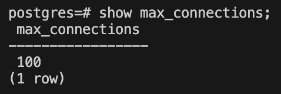
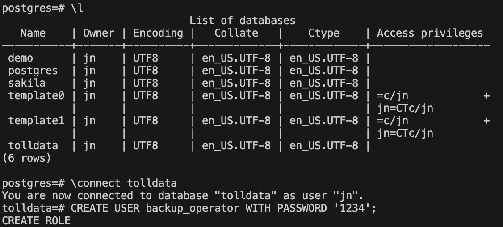
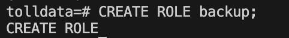
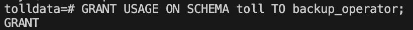
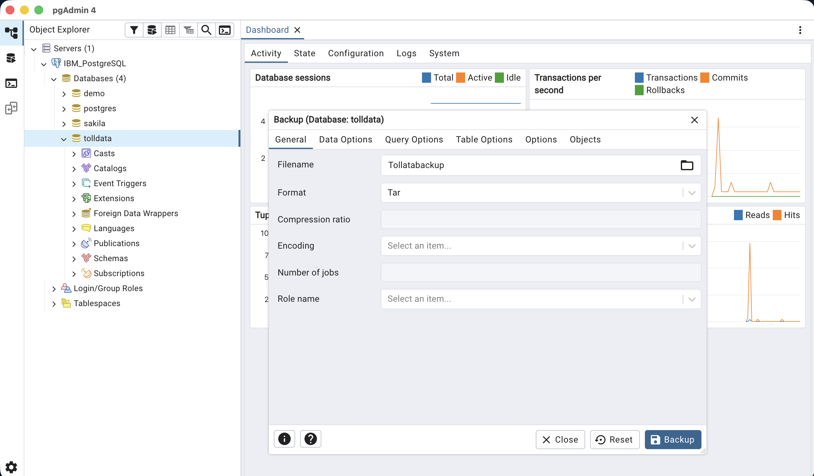

# Final project 1
Based on **postgres-setup.sh**, with some modifications to the configuration
### Task 1.1: Find the settings in PostgreSQL
* Check the max_connections setting for the PostgreSQL server

    

### Task 1.2: User Management
* Create a user named **backup_operator**
    

### Task 1.3: Create a Role
* Create a role named **backup**

    

### Task 1.4: Grant privileges to the role
* Grant the following privileges to the backup role.
    

### Task 1.5: Grant role to an user
* Grant the role backup to backup_operator

    

### Task 1.6: Backup a database on PostgreSQL server
* Backup the database tolldata using PGADMIN GUI.
* Backup the database tolldata into a file named tolldatabackup.tar, select the backup format as Tar
    