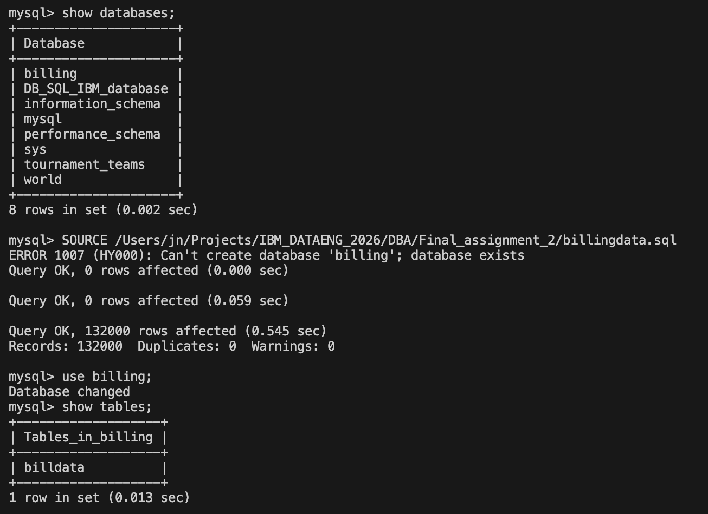
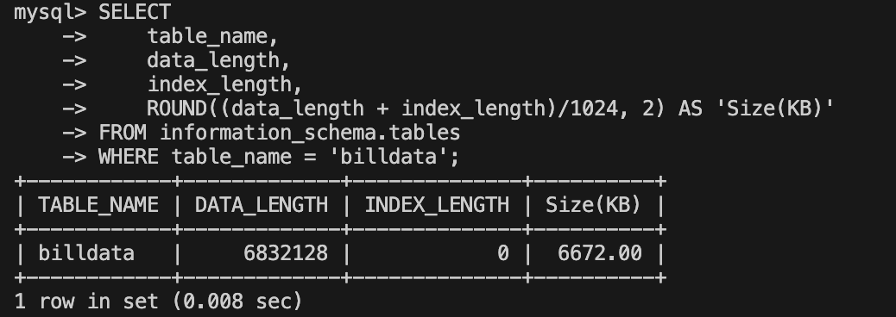
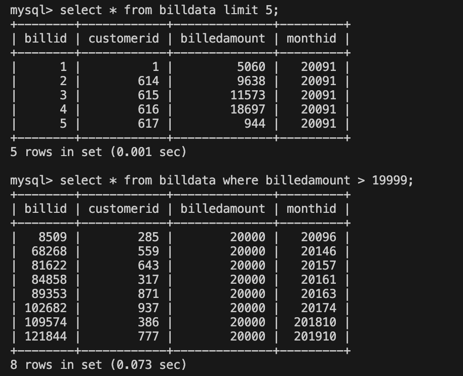
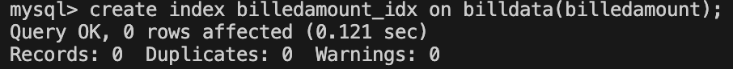
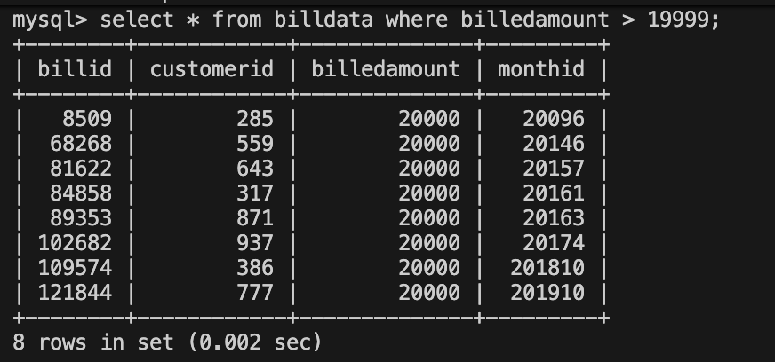
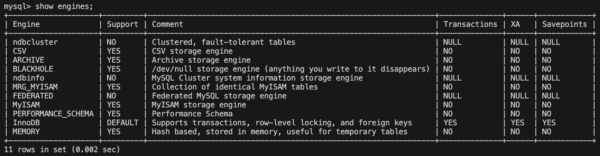
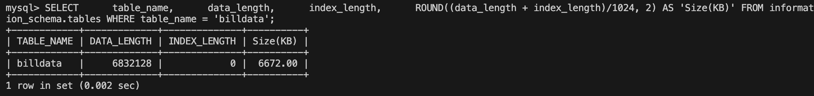

# Final project 2
You have assumed the role of database administrator for the MySQL server and will perform the tasks like configuration check, recovery of data. You will use indexing to improve the database performance. You will identify which storage engines are supported by the server and which table uses which storage engine. Optionally You will also automate backup tasks.

### Task 2.1: Set up the lab environment
Restore this file onto MySQL server. List the tables in the billing database.
1) Activate MySQL --> `mysql -u root -h <host> -P <port> -p`
2) Explore databases --> `show databases;`
3) Run sql file --> `SOURCE <full path of billingdata.sql`

### Task 2.2: Recovery
4) Find the tables in the billing database. 
    ```
    USE billing;
    SHOW tables;
    ```
    

5) Find the data size of the table billdata.
    ```
    SELECT 
        table_name, 
        data_length, 
        index_length, 
        ROUND((data_length + index_length)/1024, 2) AS 'Size(KB)'
    FROM information_schema.tables
    WHERE table_name = 'billdata';
    ```
    

### Task 2.3: Indexing
* select all rows with a billedamount > 19999 in table billdata
    ```
    SELECT *
    FROM billdata
    WHERE billedamount > 19999;
    ```
    
* create an appropriate index to make it run faster
    
* Document the improvement in query performance
    

### Task 2.4: Storage Engines
* Run a command to find out if your MySQL server supports the MyISAM storage engine.
    
* Find the storage engine of the table billdata.
    

### Task 2.5- OPTIONAL Exercise (Non-graded) Automation of routine tasks
* Write a bash script that performs a backup of all the databases
mysqldump is a command line tool that performs logical backups of a database.

    - Its generic syntax is mysqldump db_name > backup-file.sql

    - Its extended syntax is mysqldump --all-databases --user=root --password=xxx > backup-file.sql

    - Write a bash script named mybackup.shthat performs the following tasks.

    - Perform the backup of all databases using the mysqldump
    Store the output in the file all-databases-backup.sql
    In the /tmp directory, create a directory named after current date like YYYYMMDD. For example, 20210830
    - Move the file all-databases-backup.sql to /tmp/mysqldumps/<current date>/ directory
