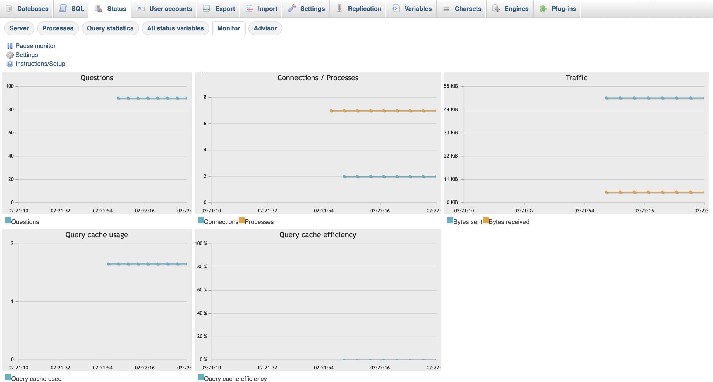
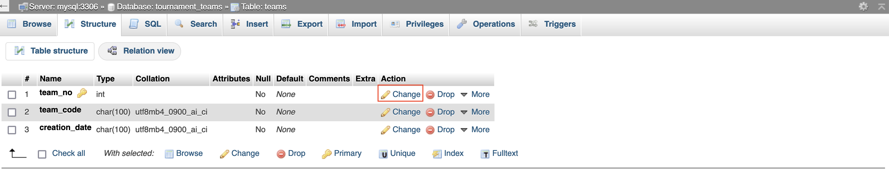
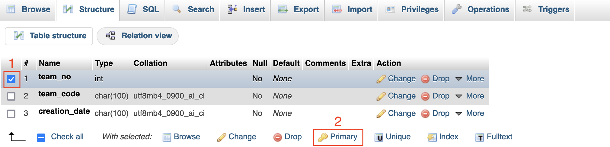
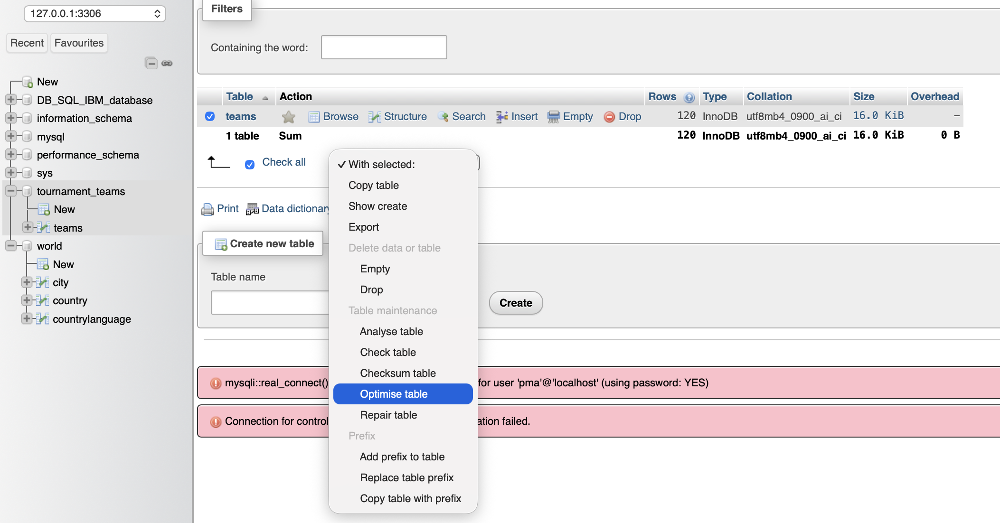
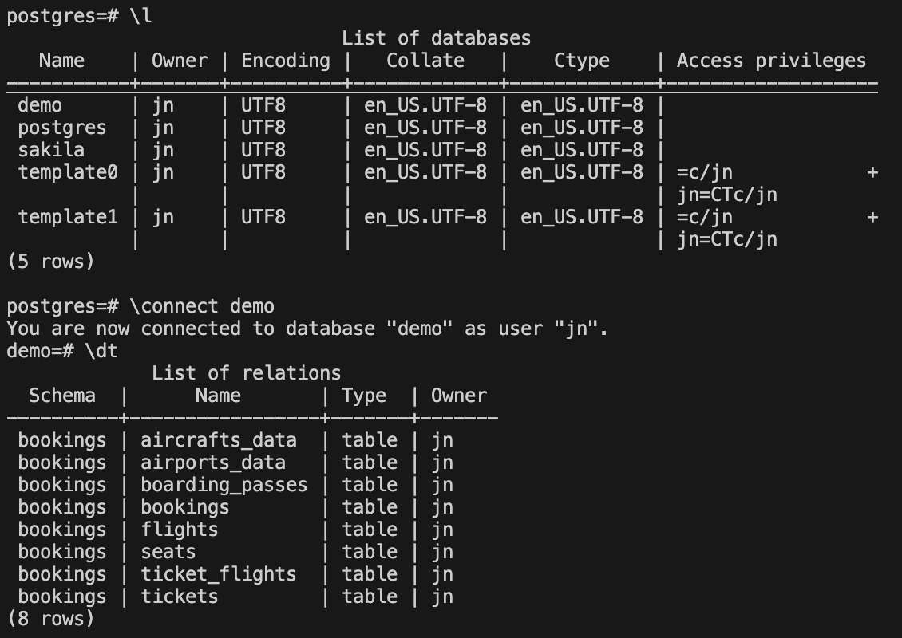
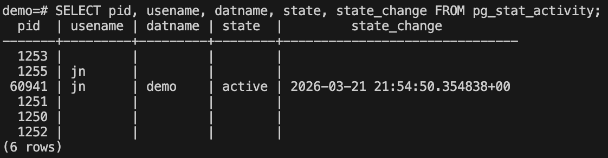
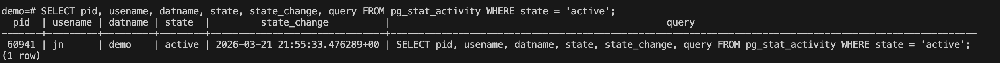
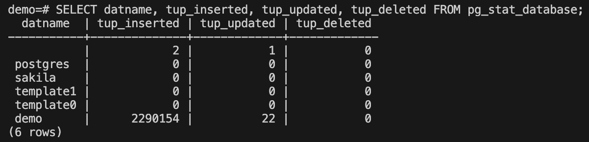

# Module1: Introduction to database management
### Data Security, Ethical, and Compliance Considerations

🌟  **DBA responsibility:** Protect data and ensure it follows laws, standards, and ethical practices.

* **Ethics**

    * **Transparency:** Tell users what data is collected and how it is used.
    * **Consent:** Get permission before collecting data.
    * **Integrity:** Follow clear policies and procedures.

* **Secure System Design**
    * Protect against cyberattacks (firewalls, security tools).
    * Use secure storage and regular backups.
    * Limit access to only authorized users.
    * Secure data transfer and archiving.

* **Compliance**
    * Follow **legal regulations** (e.g., GDPR, HIPAA).
    * Follow **industry standards** (e.g., PCI DSS).
    * Follow **organizational policies** for data protection.
---
### Server Objects and Hierarchy
* **Database objects**
    * **Hierarchy:** Instance → Database → Schema → Objects
    * **Instance:** Logical environment containing databases.
    * **Schema:** Logical group of database objects.
    * **Objects:** Tables, indexes, keys, constraints, views, triggers.

* **System Objects & Configuration**
    * Store **metadata** (information about the database).
    * Also called **system catalog / data dictionary**.
    * **Config files** set parameters like memory, ports, storage.

* **Database Storage**
    * **Logical storage:** tables, tablespaces.
    * **Physical storage:** disk files.
    * **Tablespaces:** organize objects and map them to storage.
    * **Partitions:** split large tables for better performance.

* **MySQL Storage Engines**
    * Control **how data is stored and accessed**.
    * **InnoDB** (default), **MyISAM**, **MEMORY**, **ARCHIVE**, **CSV**.


# Module2: Managing databases
### Backup & Recovery
* **Backup Basics**
    * Backup protects data from **loss, corruption, or crashes**.
    * 2 types:
        * **Logical backup**: SQL commands (DDL/DML) to recreate data.
        * **Physical backup**: Copy of raw database files.

* **Backup Types**
    * **Full**: Complete copy of database.
    * **Differential**: Changes since last full backup.
    * **Incremental**: Changes since last backup.
    * **Point-in-time recovery**: Restore using logs to a specific moment.

* **Backup Policies**
    * **Hot backup**: Done while database is running (no downtime).
    * **Cold backup**: Database offline during backup (safer but downtime).
    * Choose frequency based on **data importance and change rate**.
    * Use **automation, compression, and encryption** when needed.

* **Transaction Logs**
    * Record **all database changes (insert, update, delete)**.
    * Used with backups for **recovery and roll-forward to a specific time**.
    * Best practice: **store logs on separate storage** for reliability.
---
### Security & User management
🌟 Database security uses **authentication, permissions, roles, auditing, and encryption** to protect data and control access.
* **Database Security**
    * Protect data at **server, OS, database, and application levels**.
    * **Authentication:** verify user identity.
    * **Authorization:** give permissions to access data.
    * Use **least privilege**, **auditing**, and **encryption** for stronger security.

* **Users, Groups, and Roles**
    * **User:** account that can access the database.
    * **Group:** collection of users for easier management.
    * **Role:** set of permissions for a job function.
    * Assign permissions to **roles/groups instead of individuals**.
    * One user can belong to **multiple roles**.

* **Managing Access (Permissions)**
    * Permissions control what users can do with database objects.
    * Common privileges: **SELECT, INSERT, UPDATE, DELETE, CREATE, ALTER, EXECUTE**.
    * SQL commands:

    * **GRANT** → give permission
    * **REVOKE** → remove permission
    * **DENY** → explicitly block permission

* **Auditing Database Activity**
    * **Auditing = monitoring database access and actions**.
    * Logs help detect **unauthorized access or security gaps**.
    * Track **successful and failed login attempts**.
    * Some industries require **audit logs for compliance**.

* **Encrypting Data**
    * Encryption protects **data at rest and in transit**.
    * Converts data to **ciphertext using algorithms and keys**.
    * **Symmetric encryption:** same key (e.g., AES).
    * **Asymmetric encryption:** public + private key (e.g., RSA).
    * **TDE (Transparent Data Encryption)** encrypts database automatically.
    * **TLS/SSL** protect data during network transmission.
    * Encryption **improves security but may reduce performance**.

# Module3: Monitoring & Optimization
### Using Indexes 
🌟 Well-designed indexes are essential for **fast database queries and performance optimization**.

* **Database Index**
    * Improves **query/search speed** (like a book index).
    * Stores an **ordered copy of selected columns** with pointers to table rows.
    * Avoids scanning the entire table.

* **Benefits & Trade-offs**
    * Faster **data retrieval**.
    * Requires **extra storage** and **maintenance updates**.

* **Types of Indexes**
    * **Primary Key Index**
        * Unique, non-null, one per table.
        * Usually **clustered** (table stored in same order).
    * **Secondary (Non-clustered) Index**
        * Additional indexes on one or more columns.
        * Can be **unique or non-unique**.

* **Creating Keys & Indexes**
    * **Primary Key**
        * Defined when creating a table.
        * Can use **AUTO_INCREMENT (MySQL)** or **IDENTITY (Db2)**.
    * **Create Index**
        ```sql
        CREATE INDEX index_name
        ON table_name(column1, column2);
        ```
    * **Drop Index**
        ```sql
        DROP INDEX index_name;
        ```
    *(Primary/unique indexes must be removed via `ALTER TABLE` first.)*

* **Index Design Tips**
    * Analyze **frequent queries**.
    * Understand **column data types and uniqueness**.
    * Use **narrow indexes** for lower maintenance.
    * Store indexes efficiently for **better disk I/O performance**.
* **Optimizing**
    * Optimize Table reorganizes storage and indexes to reduce fragmentation and improve query performance
    **Hands-on example:**
        * **MySQL** usually managed with phpMyAdmin
            1) Setup database named "world" and load data `world_mysql_script.sql`
            2) Goto **phpMyAdmin** > Status which the rest of the subpages to gain a better understanding of the current status of your server.
            
            3) There are 3 ways to optimize a database.
            Here’s a simple comparison table:

            | Optimization Method  | What It Does | Key Benefit | Figures |
            | -------------------- | ------------ | ------------| ------- |
            | Efficient Data Types | Uses appropriate, smaller data types for each column | Reduces storage and speeds up queries | 
            | Indexing             | Adds indexes (e.g., primary key) to columns          | Speeds up data search and retrieval         | 
            | Optimize Table       | Reorganizes table data and indexes (e.g., `OPTIMIZE TABLE`) | Improves performance and frees unused space | 
  
        * **Postgres** commonly managed with CLI, but GUI tools like pgAdmin or DBeaver exists too.
            1) Setup Postgres and run this command to activate `psql -U <username> -h <host> -p <port> -d <database_name>`
            2) Import the data from file:  `\i <flight_RUSSIA_smal.sql file path>`
            3) Explore lists of database `\l`
            4) Connect to demo database: '\connect demo' and \dt to see table relation inside
                
            5) Database monitoring
                
            6) See all the aforementioned columns, in addition to the actual text of the query that was last executed.
                
            7) Database activity
                
    * **Vacuum** feature in postgres is like feature for cleaning database.
        * Removes dead tuples (deleted rows still taking space)
        * Helps free storage & improve performance
        * Autovacuum is usually enabled → runs automatically without manual work

# Module4: Troubleshooting & Automation
* Use PostgreSQL in Cloud IDE and restore the demo database
* Enable logging (`logging_collector = on`) and view logs for troubleshooting
* Test performance using `\timing` (simple vs heavy queries)
* Simulate multiple users → encounter error: **too many clients already**
* Diagnose via logs → issue caused by low `max_connections = 4`
* Identify poor configuration + low memory as root causes

    * **Increase:**
        * `max_connections → 100`
        * `shared_buffers → 128MB`
        * `work_mem → 4MB`
        * `maintenance_work_mem → 64MB`
        * Restart server

    * **Result:**
        * Queries run faster
        * Multiple connections work
        * System becomes stable
