# Hands-on Lab : CREATE, ALTER, TRUNCATE, DROP
1) Access to **phpMyadmin** GUI tools
2) Create new database named Mysql_Learners and leave the default utf8 encoding

### Create statement
3) Create table from SQL
    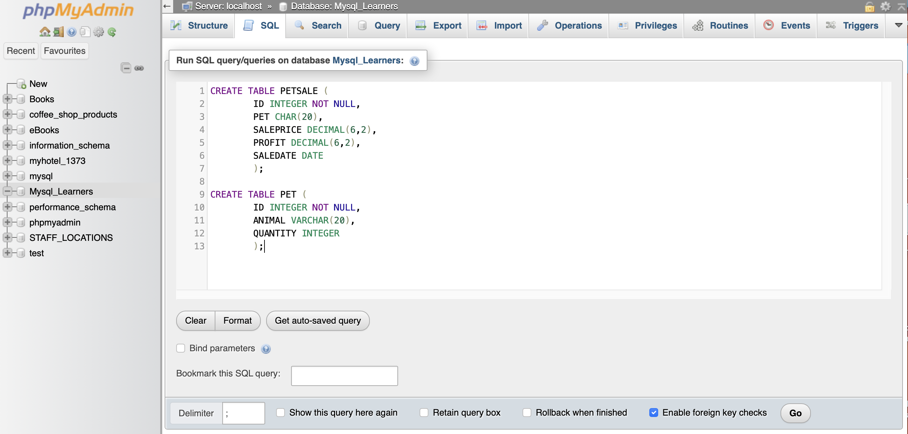
    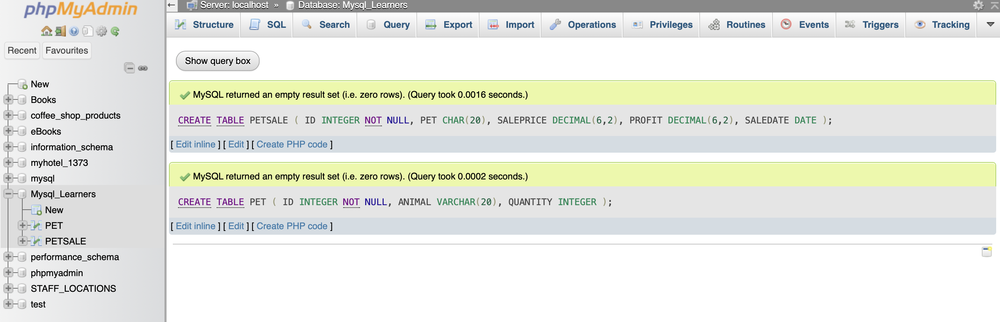

### Insert statement
4) Insert table from SQL
    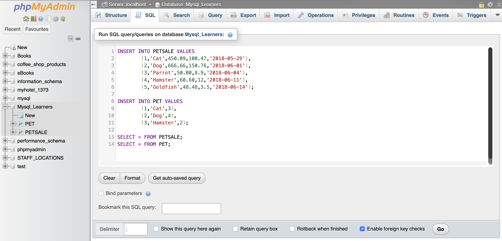
    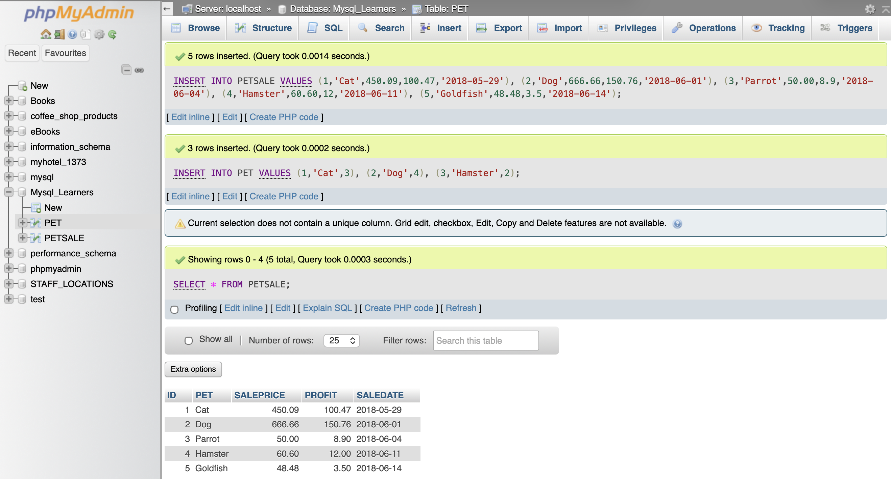

### Alter statement

5) **Add** a new column named QUANTITY to the PETSALE table 
    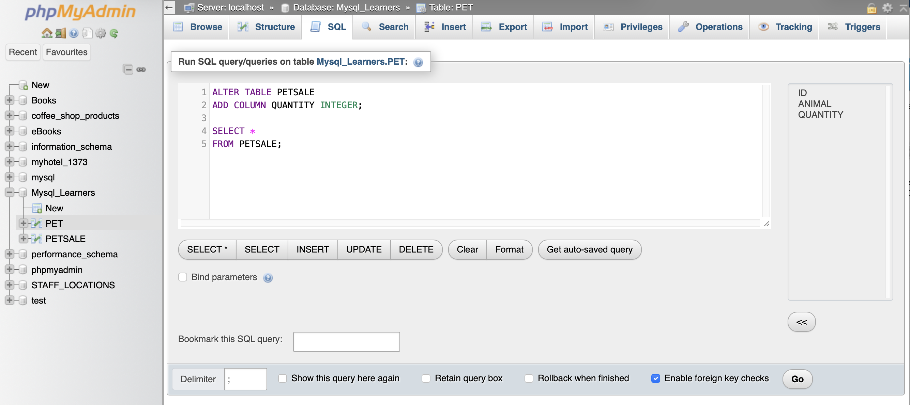
    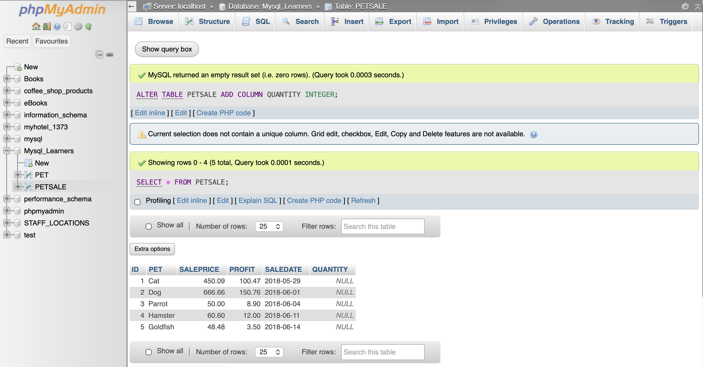
6) **Update** data in QUANTITY column
    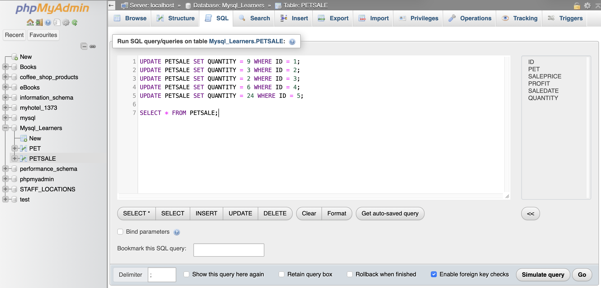
    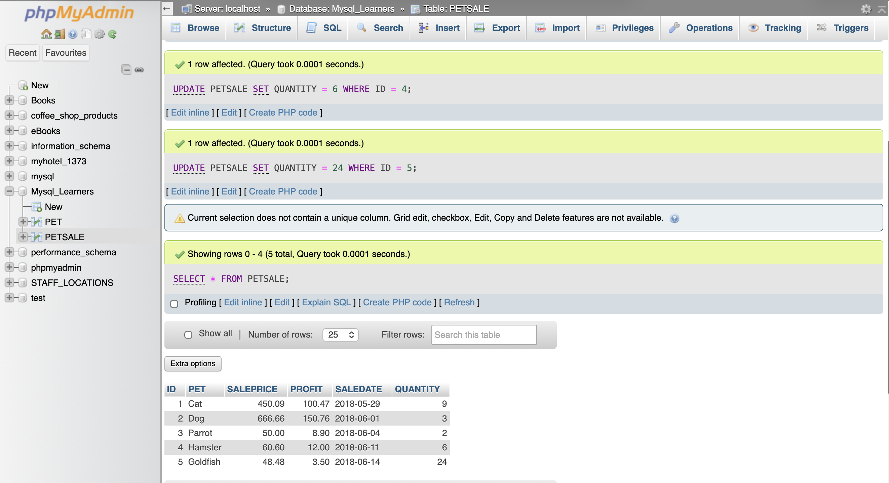
7) **Delete** the PROFIT column from the PETSALE table and show the altered table. 
    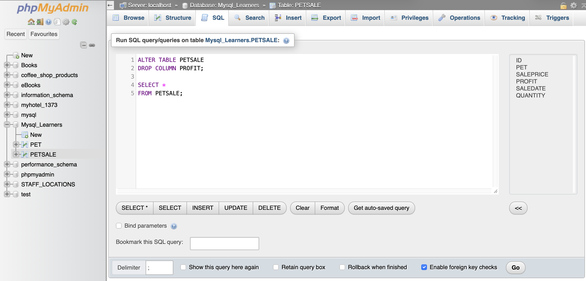
    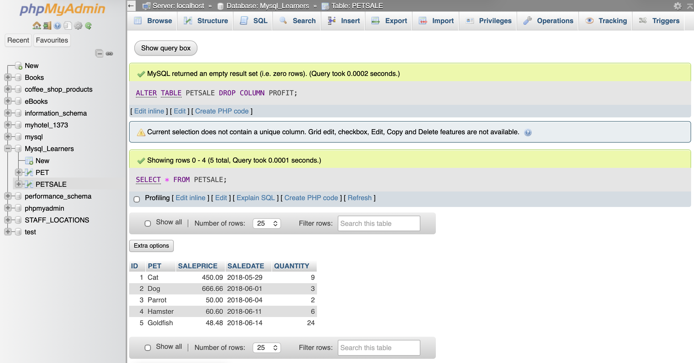
8) **Modify** data type to VARCHAR(20) type of the column PET of the table PETSALE
    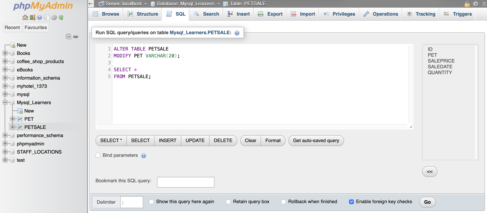
    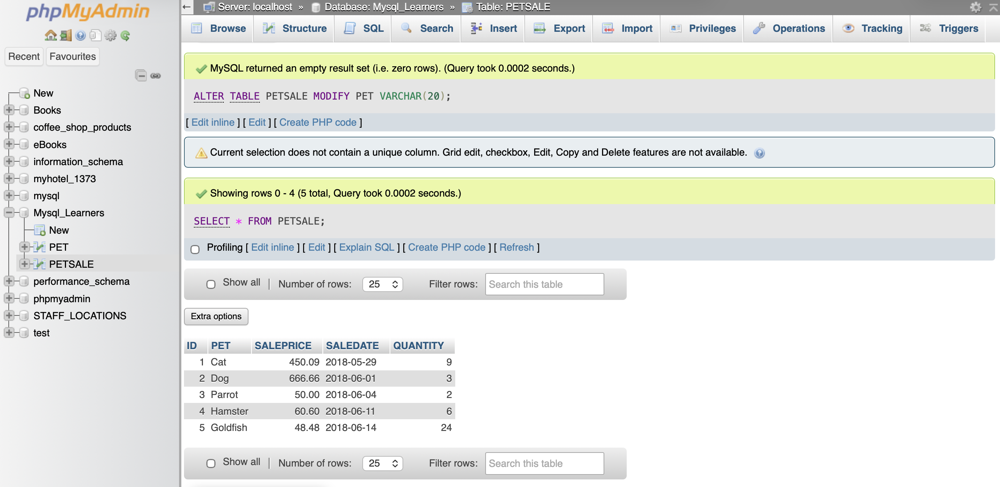
9) **Rename** the column PET to ANIMAL of the PETSALE table and show the altered table.
    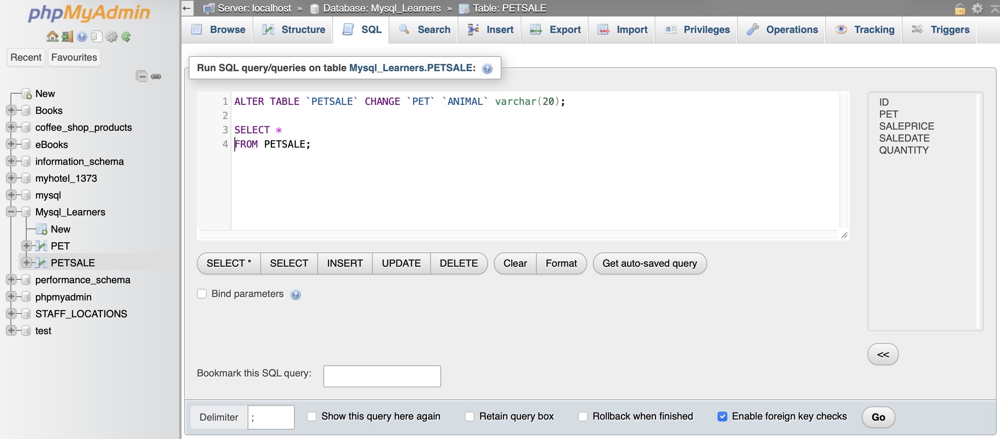
    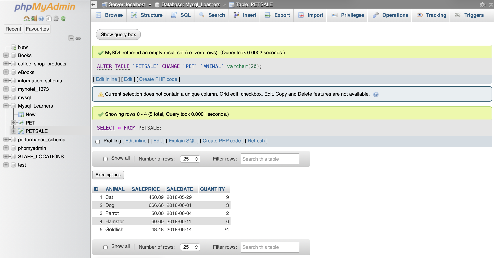

### TRUNCATE statement 
This statement is like use it to remove all rows from an existing table without deleting it.

10) Remove all rows from the PET table and show the empty table 
    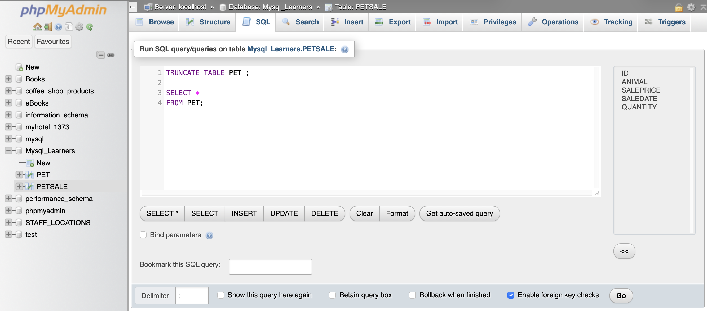
    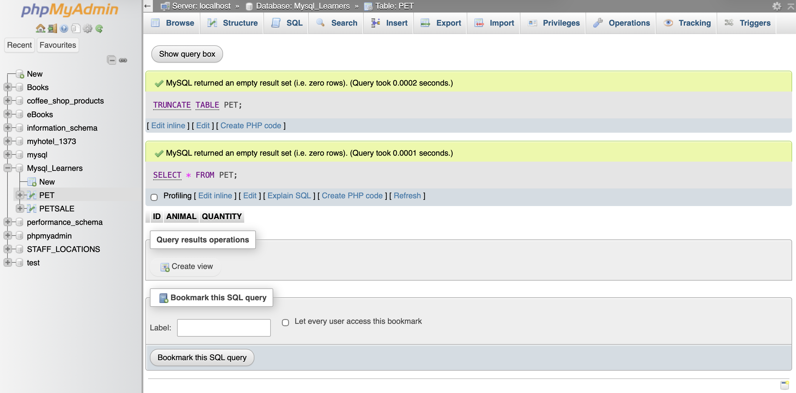

### [Task] DROP statement 
11) Delete an existing table
    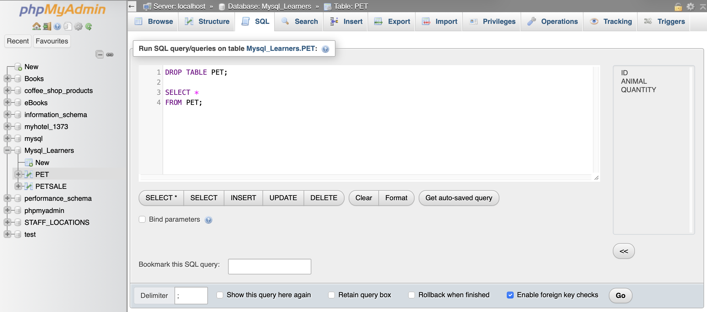
    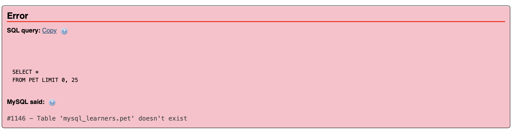

# Hands-on Lab: Create and Load Tables using SQL Scripts
1) Create database `CVD`
    
2) Create tables using SQL script
    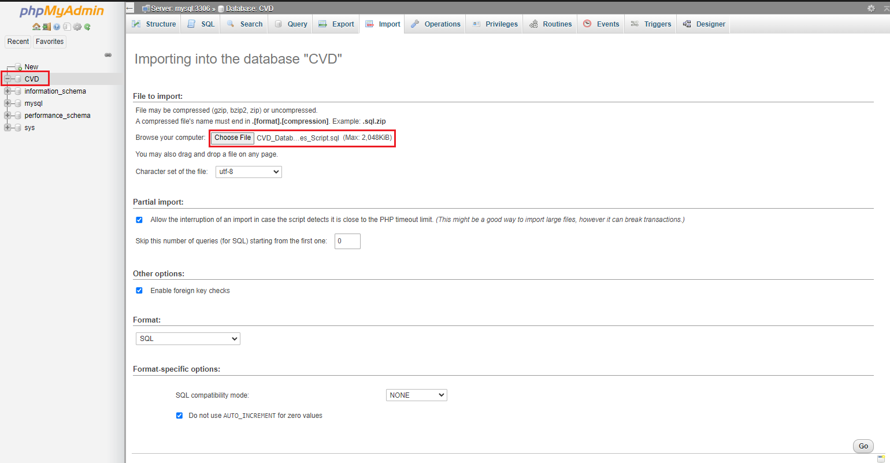
    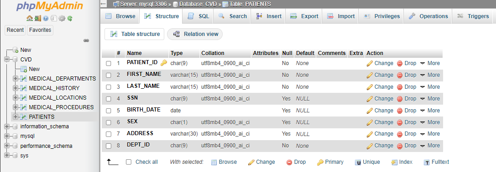
3) Load data into tables
    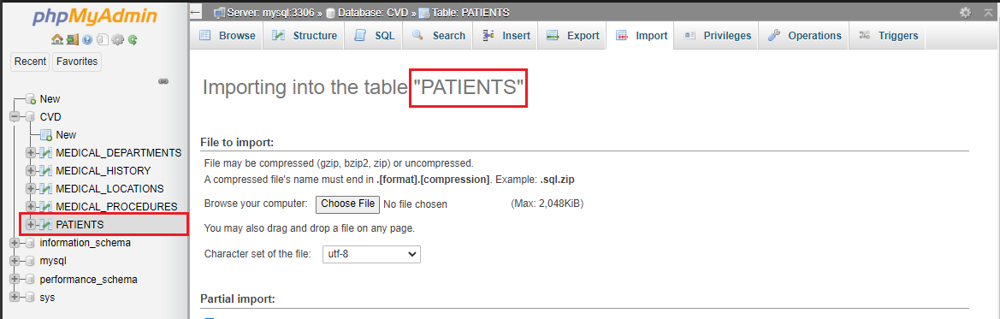
4) Browse to view table's data
    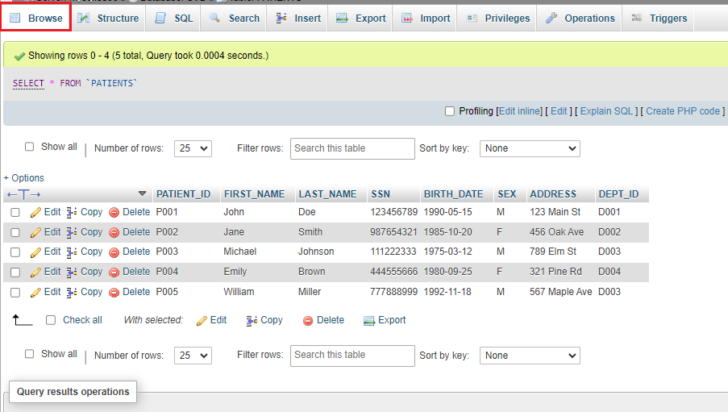
