# Hands-on Lab: String Patterns, Sorting and Grouping in MySQL
    
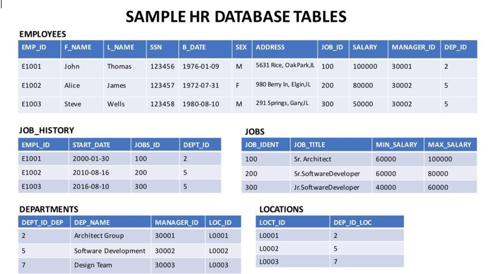
1) Create database named **HR**
2) Create table from this sql
    ```
    CREATE TABLE EMPLOYEES (
                            EMP_ID CHAR(9) NOT NULL, 
                            F_NAME VARCHAR(15) NOT NULL,
                            L_NAME VARCHAR(15) NOT NULL,
                            SSN CHAR(9),
                            B_DATE DATE,
                            SEX CHAR,
                            ADDRESS VARCHAR(30),
                            JOB_ID CHAR(9),
                            SALARY DECIMAL(10,2),
                            MANAGER_ID CHAR(9),
                            DEP_ID CHAR(9) NOT NULL,
                            PRIMARY KEY (EMP_ID));

    CREATE TABLE JOB_HISTORY (
                            EMPL_ID CHAR(9) NOT NULL, 
                            START_DATE DATE,
                            JOBS_ID CHAR(9) NOT NULL,
                            DEPT_ID CHAR(9),
                            PRIMARY KEY (EMPL_ID,JOBS_ID));

    CREATE TABLE JOBS (
                            JOB_IDENT CHAR(9) NOT NULL, 
                            JOB_TITLE VARCHAR(30),
                            MIN_SALARY DECIMAL(10,2),
                            MAX_SALARY DECIMAL(10,2),
                            PRIMARY KEY (JOB_IDENT));

    CREATE TABLE DEPARTMENTS (
                            DEPT_ID_DEP CHAR(9) NOT NULL, 
                            DEP_NAME VARCHAR(15) ,
                            MANAGER_ID CHAR(9),
                            LOC_ID CHAR(9),
                            PRIMARY KEY (DEPT_ID_DEP));

    CREATE TABLE LOCATIONS (
                            LOCT_ID CHAR(9) NOT NULL,
                            DEP_ID_LOC CHAR(9) NOT NULL,
                            PRIMARY KEY (LOCT_ID,DEP_ID_LOC));                      
    ```
3) Use each of these files to the iterface as data for respective tables in the ‘HR’ database.

    - Departments.csv
    - Jobs.csv
    - JobsHistory.csv
    - Locations.csv
    - Employees.csv
4) Use **string patterns** to filter the response of a query 
    - Name of who live in Elgin, IL
        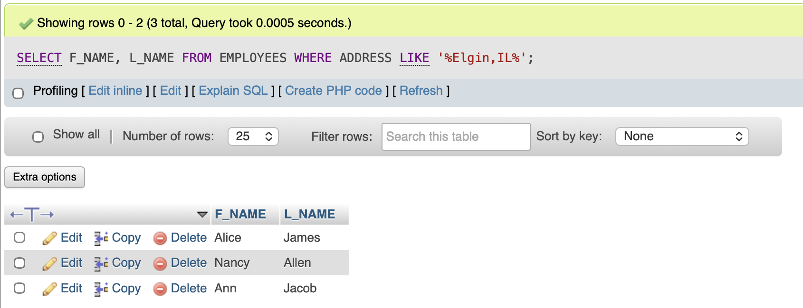
    - Name of who were born during the 70s
        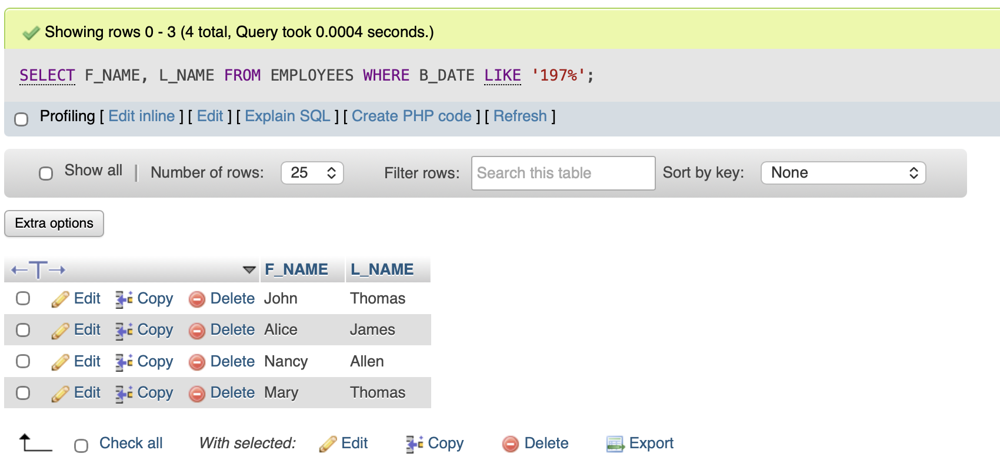
    - Name of ecords in department 5 where salary is between 60000 and 70000
        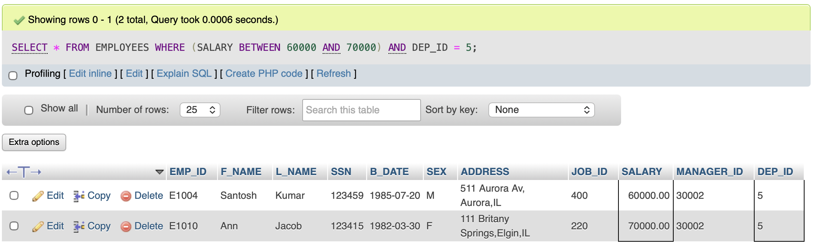
5) Use **sort** the retrieved entries on the basis of one or more parameters.
    - Sorts the records in ascending order
        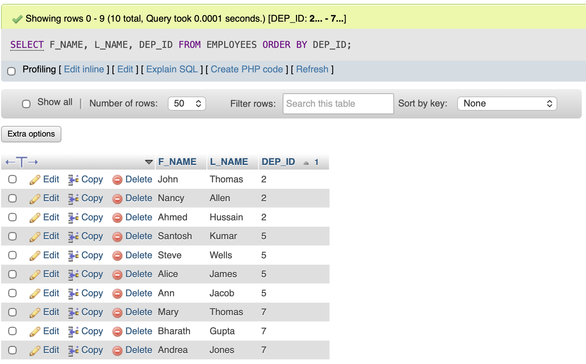
    - Output of the same query in descending order of department ID, and within each deaprtment
        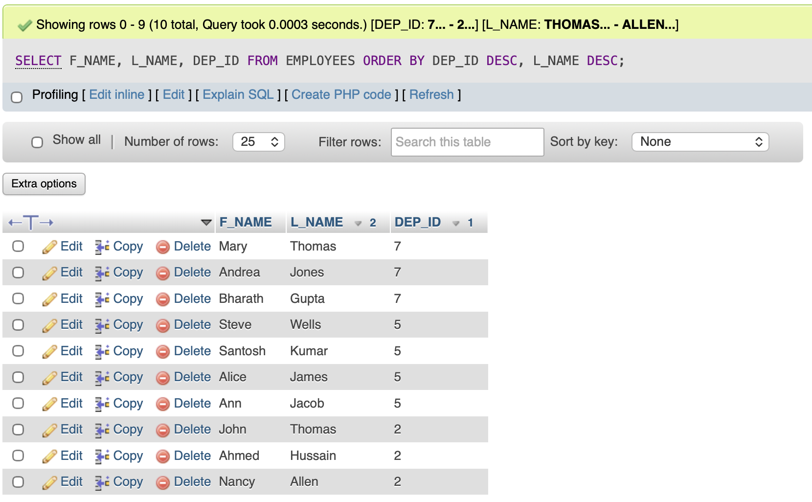
6) Use **grouping** usually works with **aggregate function**
    - Grouping would be if For each department ID, we wish to retrieve the number of employees in the department
        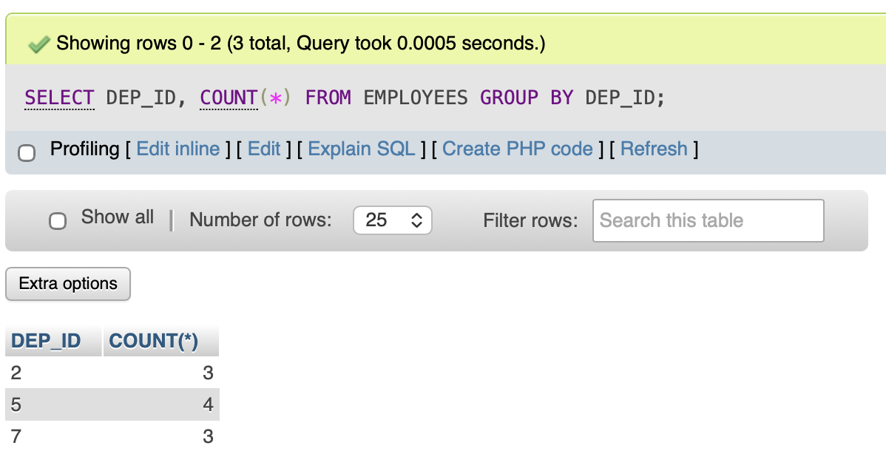
    - Retrieve, for each department, the number of employees and the average salary by using COUNT(*) and AVG() with GROUP BY.
        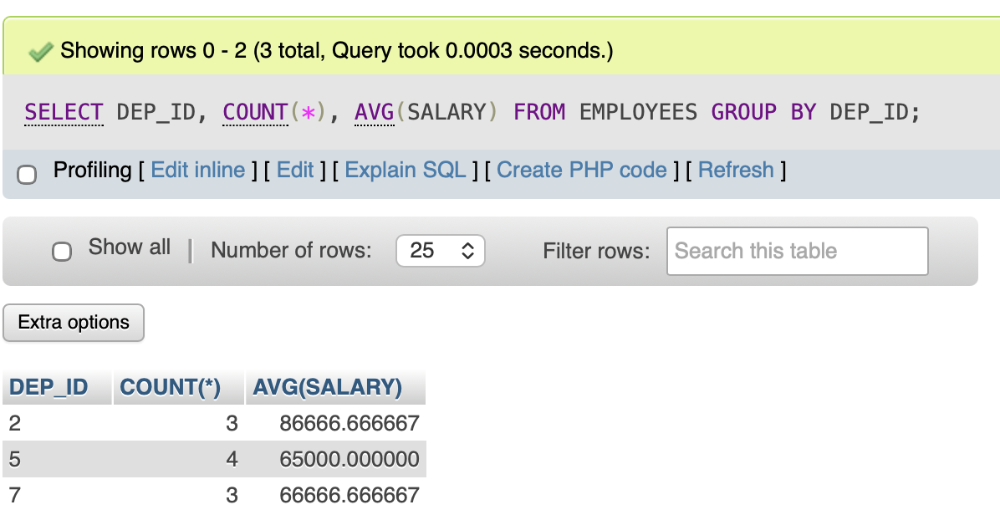
    - Use column aliases to label the computed results as NUM_EMPLOYEES and AVG_SALARY.
        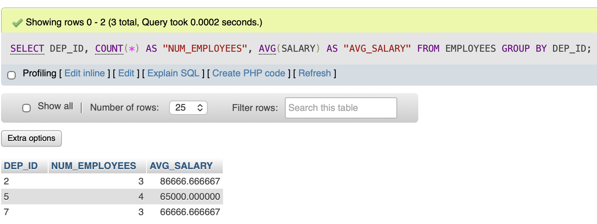
    - You can combine GROUP BY and ORDER BY to sort grouped results based on a specific column. In this case, the ORDER BY clause must come after the GROUP BY clause. For example, to sort grouped results by average salary.
        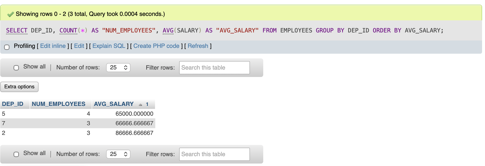
    - To filter grouped results, use the HAVING clause.
For example, to show only departments with fewer than 4 employees, apply HAVING after GROUP BY and use the COUNT() function instead of the column alias.
        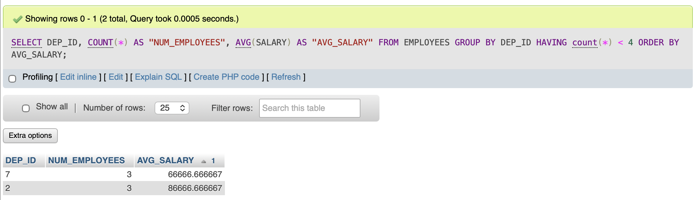


# Hands-on Lab: Built-in functions
1) Import **PETRESCUE-CREATE.sql** to **Mysql_Learners** database
    `SELECT * FROM PETRESCUE;`
    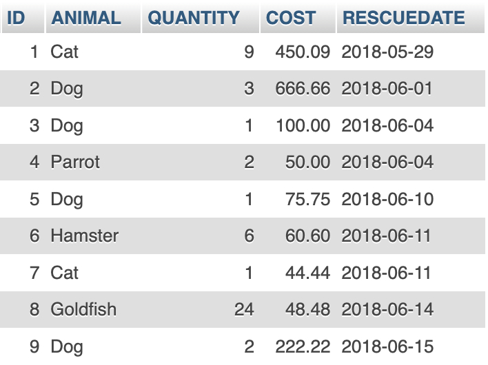
2) **Aggregation Function**

    |Function Type| Query | Result |
    |-------------|-------|--------|
    | **SUM** | `SELECT SUM(COST) FROM PETRESCUE;`| 
    | **MAX** | `SELECT MAX(QUANTITY) FROM PETRESCUE;`| 
    | **MIN** | `SELECT MIN(QUANTITY) FROM PETRESCUE;`| 
    | **AVG** | `SELECT AVG(COST) FROM PETRESCUE;`| 

3) **Scalar Functions**
    |Function Type| Query | Result |
    |-------------|-------|--------|
    |  **ROUND**  | `SELECT ROUND(COST) FROM PETRESCUE;`| 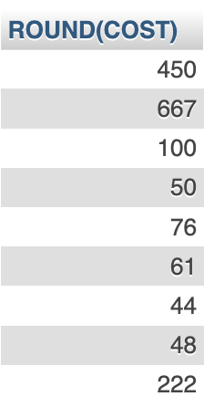
    |             | `SELECT ROUND(COST, 0) FROM PETRESCUE;`| 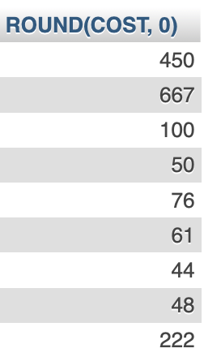
    |             | `SELECT ROUND(COST, 2) FROM PETRESCUE;`| 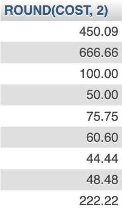

4) **String Functions**
    |Function Type| Query | Result |
    |-------------|-------|--------|
    |  **LENGTH** | `SELECT LENGTH(ANIMAL) FROM PETRESCUE;`| 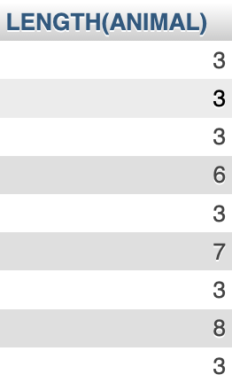|
    |  **UCASE**  | `SELECT UCASE(ANIMAL) FROM PETRESCUE;`| 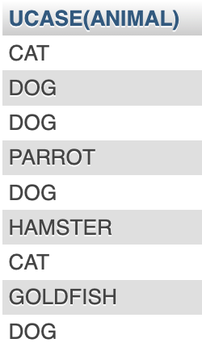|
    |  **LCASE**  | `SELECT LCASE(ANIMAL) FROM PETRESCUE;`| 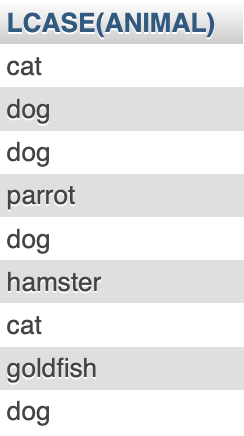|

5) **Date Functions**
    |Function Type| Query | Result |
    |-------------|-------|--------|
    |   **DAY**   | `SELECT DAY(RESCUEDATE) FROM PETRESCUE;`| 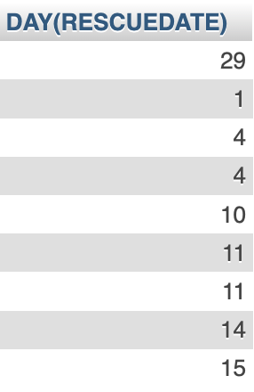|
    |  **MONTH**  | `SELECT MONTH(RESCUEDATE) FROM PETRESCUE;`| 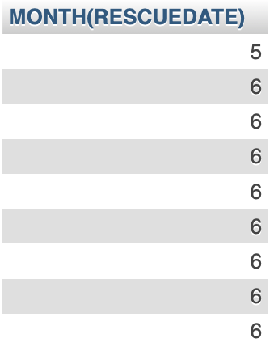|
    |   **YEAR**  | `SELECT YEAR(RESCUEDATE) FROM PETRESCUE;`| 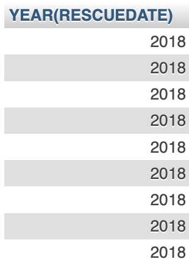|
    |  **DATE_ADD** | `SELECT ANIMAL, RESCUEDATE, DATE_ADD(RESCUEDATE, INTERVAL 3 DAY) FROM PETRESCUE;`| 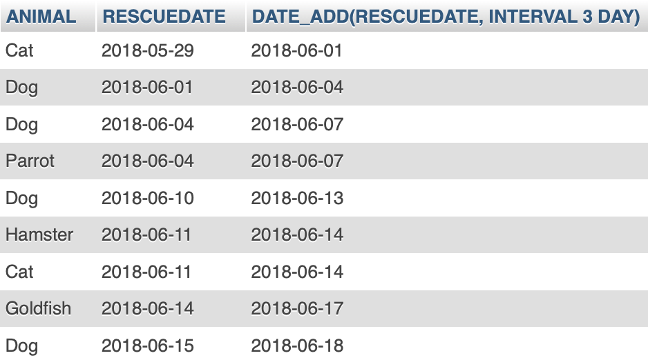
    |               | `SELECT ANIMAL, RESCUEDATE, DATE_ADD(RESCUEDATE, INTERVAL 2 MONTH) FROM PETRESCUE`| 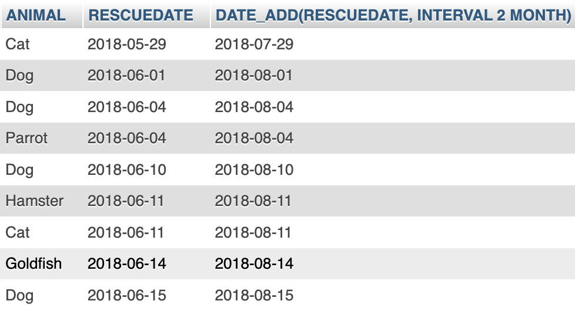|
    |  **DATE_SUB** | `SELECT ANIMAL, RESCUEDATE, DATE_SUB(RESCUEDATE, INTERVAL 3 DAY) FROM PETRESCUE`| 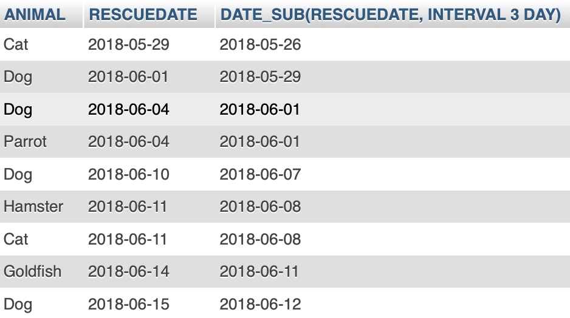
    | **DATE_DIFF** |`SELECT ANIMAL, RESCUEDATE, DATEDIFF(CURRENT_DATE, RESCUEDATE) FROM PETRESCUE;`| 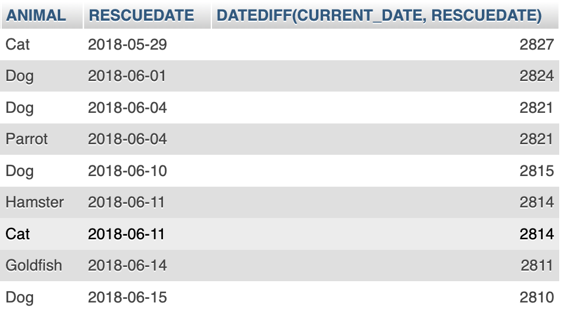
    || `SELECT FROM_DAYS(DATEDIFF(CURRENT_DATE, RESCUEDATE)) FROM PETRESCUE`| 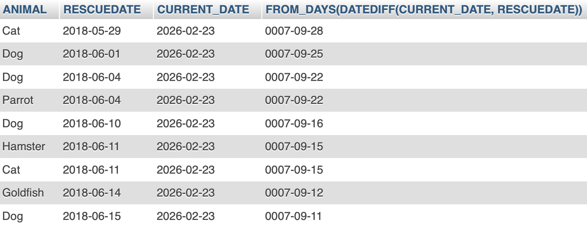|


# Hands-on Lab: Sub-queries and Nested Selects
1) The error occurs because `AVG` cannot be used directly in `WHERE`. Therefore, use a **subquery** to calculate the average first, then compare values.
    | Directly | Sub-query |
    |----------|-----------|
    |`SELECT * FROM EMPLOYEES WHERE salary < AVG(salary);`|`SELECT * FROM EMPLOYEES WHERE SALARY < (SELECT AVG(SALARY) FROM EMPLOYEES);`|
    |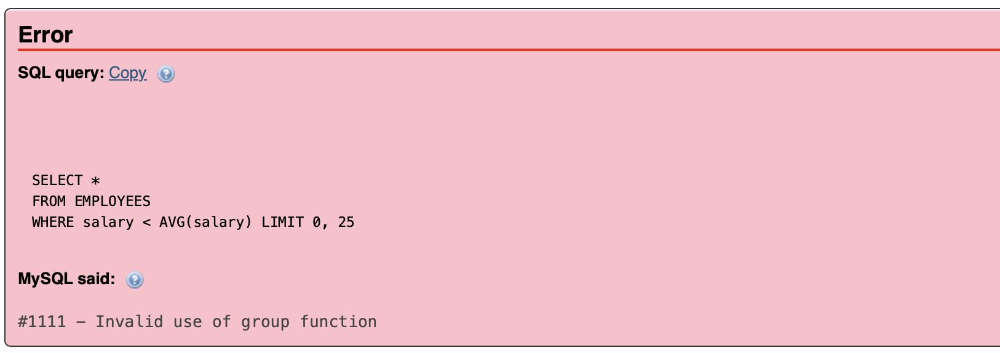|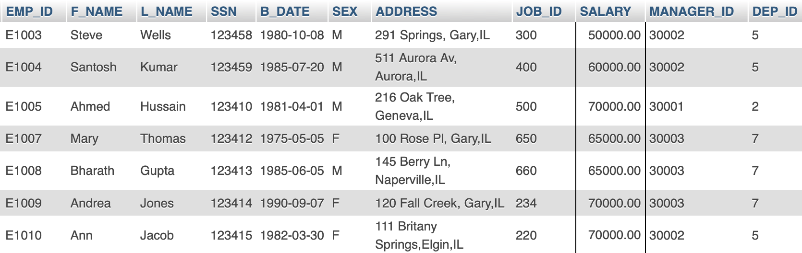|
2) Retrieve `EMP_ID`, `SALARY`, and the overall maximum salary as `MAX_SALARY` in each row.
    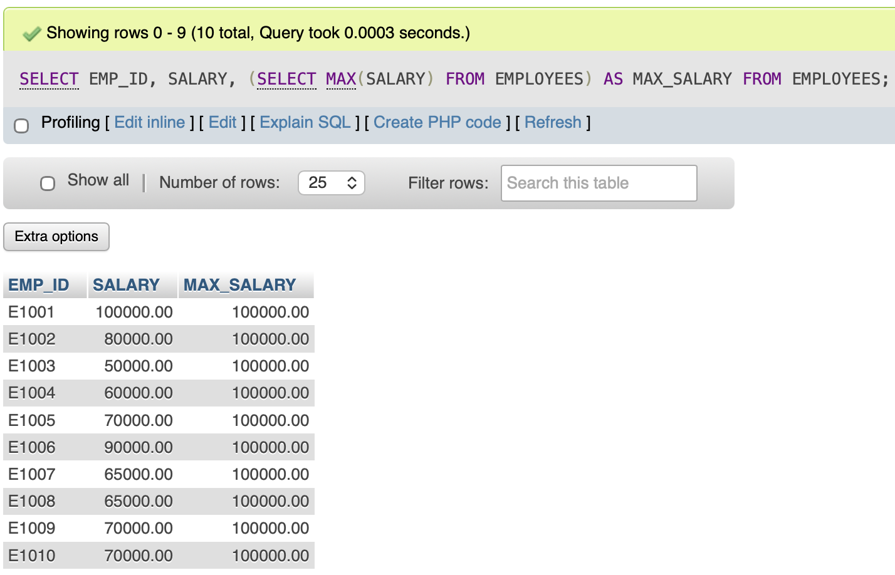
3) To find the **oldest employee**, select the first and last names of the employee with the earliest date of birth.
    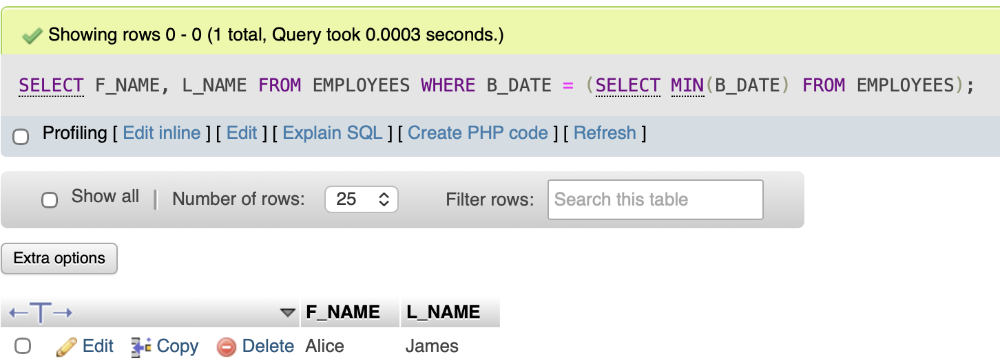
4) To find the **average salary of the top 5 earners**, first select the top five salaries, then calculate their average.
    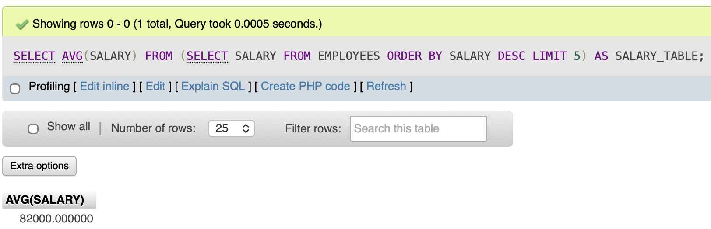


# Hands-on Lab: Working with Multiple Tables
1)  Which employees earning over $70,000
    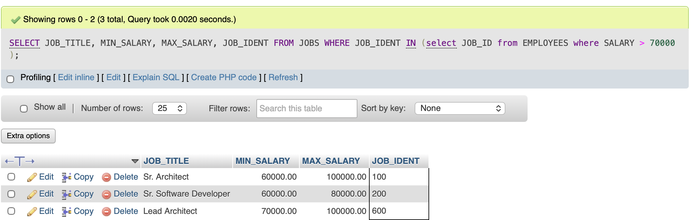
2) Accessing multiple tables with Implicit Joins
    -  EMPLOYEES records corresponding to jobs in the JOBS table
    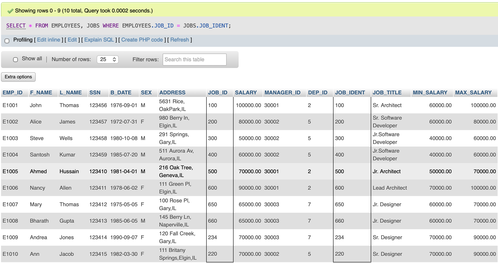
    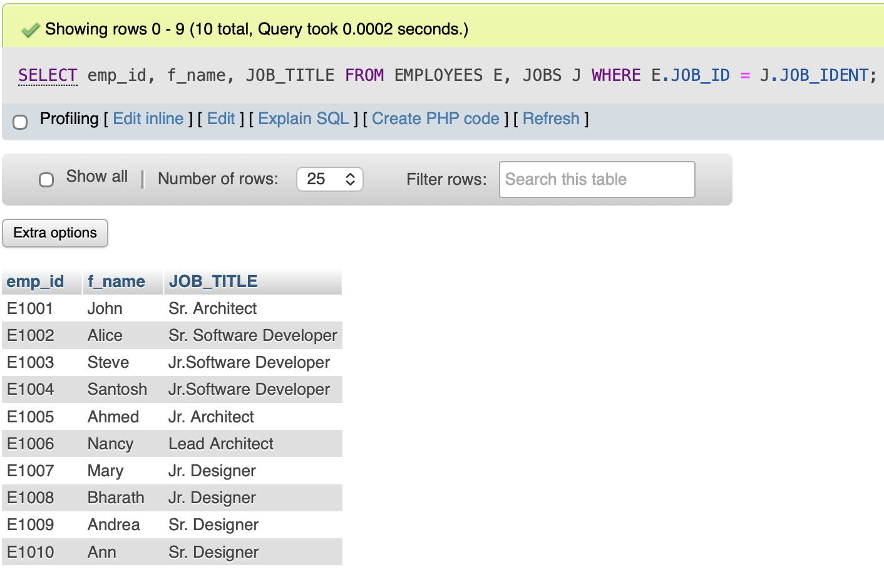