## Create Tables and Load Data in PostgreSQL using pgAdmin
In this project, you will be working with a subset of data from the Coffee shop sample data.

You will use a modified version of the data for the project, so to succeed in the project, download the linked files when prompted in the instructions. You do not need to use any data from the source.

In your scenario, you will be working with data from the following sources:

Staff information held in a spreadsheet at headquarters (HQ)
Sales outlet information held in a spreadsheet at HQ
Sales data output as a CSV file from the POS system in the sales outlets
Customer data output as a CSV file from a custom customer relationship management system
Product information maintained in a spreadsheet exported from your supplier's database

### After completing this lab, you will be able to:
- Identify entities
- Identity attributes
- Create an entity relationship diagram (ERD) using the pgAdmin ERD tool
- Normalize tables
- Define keys and relationships
- Create database objects by generating and running the SQL script from the ERD tool
- Create a view and export the data
- Create a materialized view and export the data
- Import data into a MySQL database using phpMyAdmin GUI tool

### [Task 1] Identify entities
1) Review the image and identify the entities you plan to create.
    
2) Make a list of the entities you have identified. Take a screenshot and save it as Task1.jpg or Task1.png.

### [Task 2] Identify entities
1) Using the information from the sample data in the image from Task 1, identify the entity's attributes that will store the sales transaction data.

2) Make a list of the sales transaction attributes that you identified. Take a screenshot and save it as Task2.jpg or Task2.png.

### [Task 3] Create an ERD
1) Open pgAdmin
2) Create database named as **COFFEE**
3) Add ERD for the **Sales transacion** and **Product**
    | Table |  | ERD Result|
    |-------|--|-----------|
    Sales transacion | 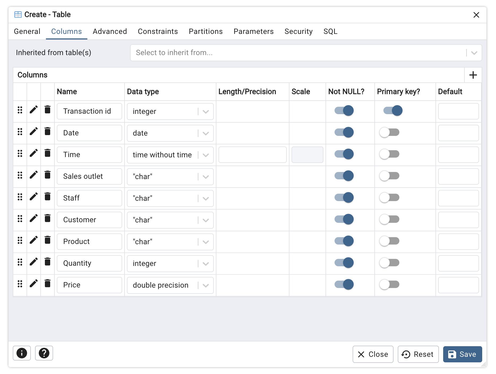 | 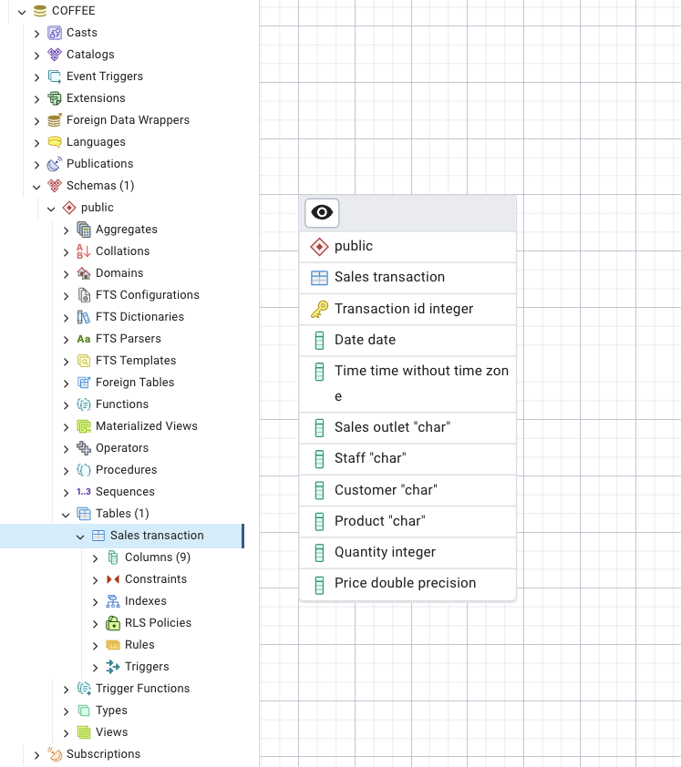
    Product | 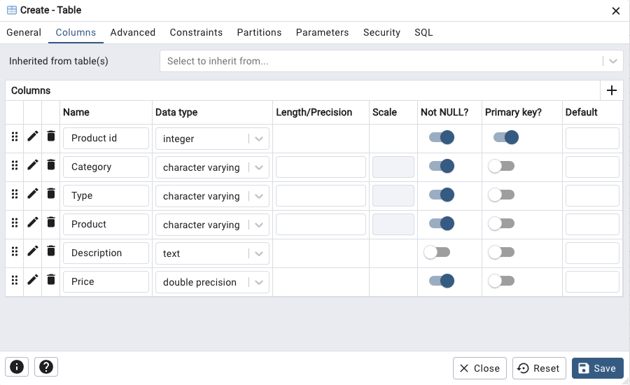 | 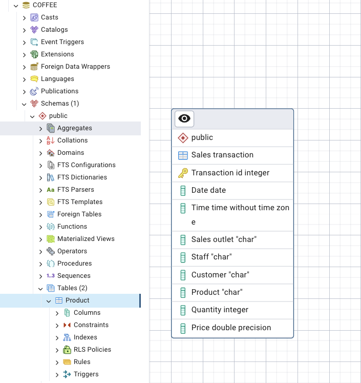

### [Task 4] Normalization
This task expects to explain into 2NF inform of ERD 

**Problem Identify:**
- transaction id is not unique
- 1 txn caqn include multiple products
- this could cause repeating rows
    
    Therefore, we split table into **Sales transaction** and **Sales Detail**
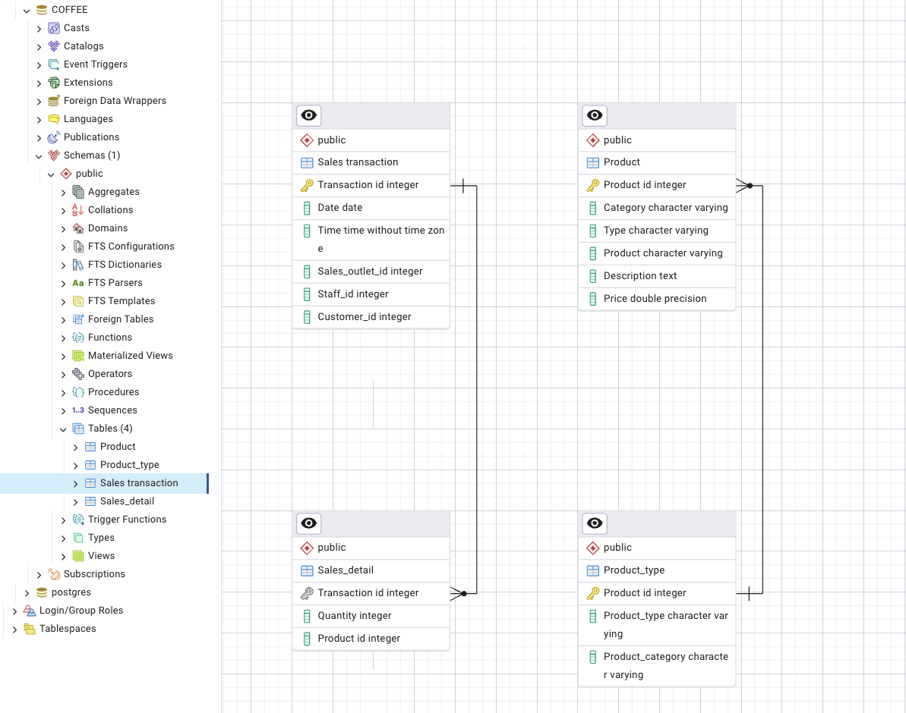

### [Task 5] Define keys and relationships


### [Task 6] Create database objects by generating and running the SQL script from the ERD tool
A provided SQL script is used to load the sample data and populate the new database schema with data from multiple sources.
```
GeneratedScript.sql
CoffeeData.sql
```
In pgAdmin, open a new Query Tool session, load the SQL file from your local computer, and run the script to populate the tables.

Tables from GeneratedScript.sql that shown in the tree-view pane for Task6A
In pgAdmin, view the first 100 rows of the **sales_detail** table for Task6B
| Task6A | Task6B |
|-------|-----------|
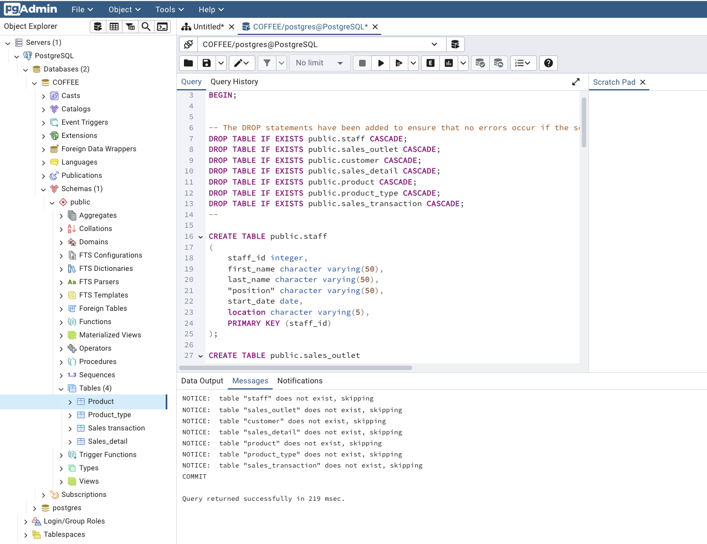|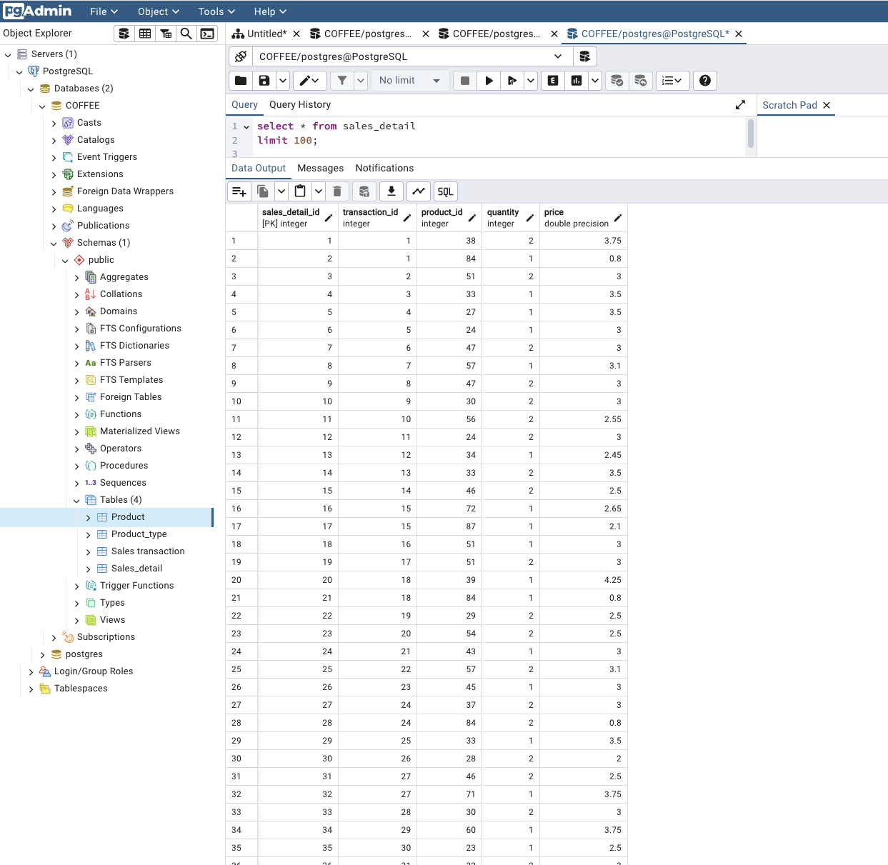

### [Task 7] Create a view and export the data
A view named **staff_locations_view** was created in the COFFEE database to display employee IDs, names, and work locations while excluding the CEO and CFO. The view results were then exported to a CSV file named 

SQL to create a view:
```SELECT staff.staff_id,
staff.first_name,
staff.last_name,
staff.location
FROM staff
WHERE "position" NOT IN ('CEO', 'CFO');
```
**staff_locations_view.csv**, and a screenshot of the view and query output was captured for submission.
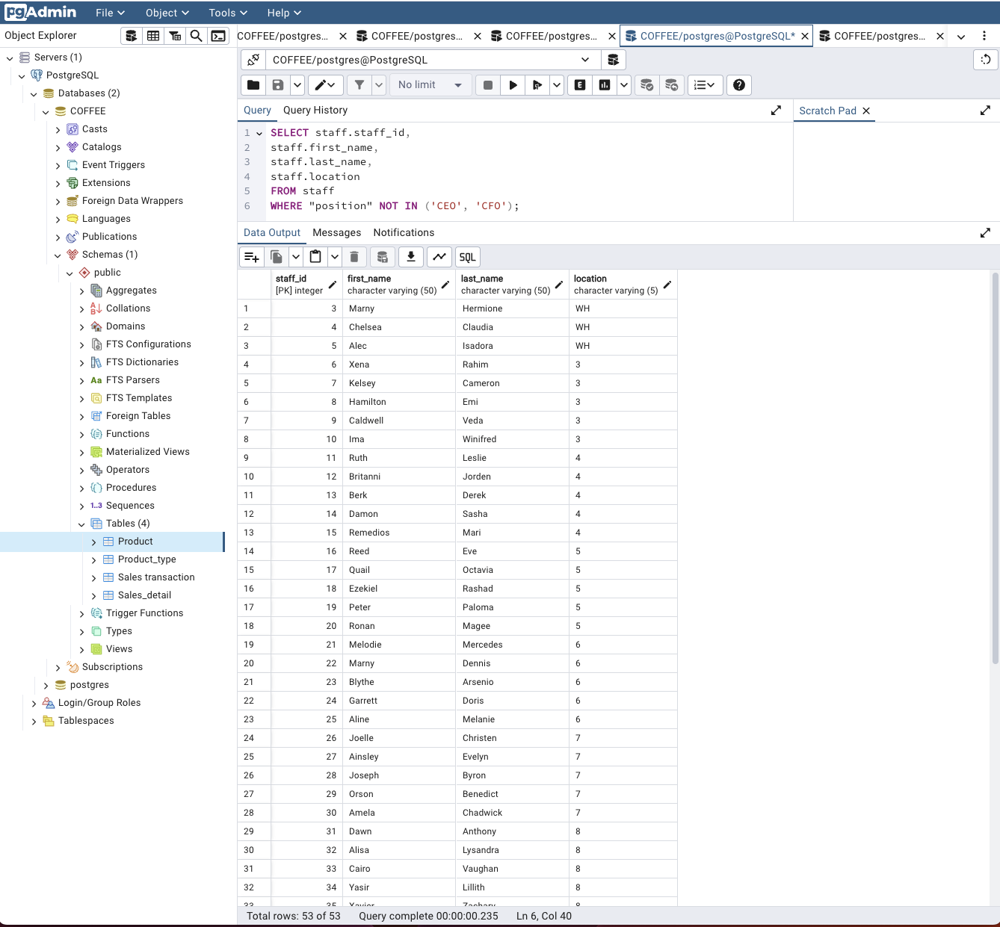

### [Task 8] Create a materialized view and export the data

SQL to create a view:
```
SELECT product.product_name, product.description, product_type.product_category
FROM product
JOIN product_type
ON product.product_type_id = product_type.product_type_id;
```
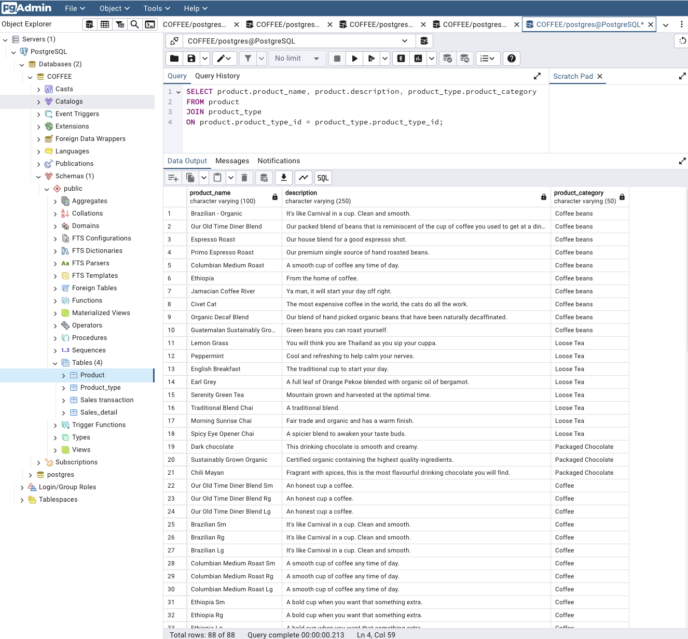

### [Task 9] Import staff_location data into a MySQL database
A new MySQL database named **STAFF_LOCATIONS** was created in phpMyAdmin, and the **staff_locations_view.csv** file was imported into it. The table was then explored to verify that the staff location data was successfully loaded, and a screenshot of the table contents was captured for submission.
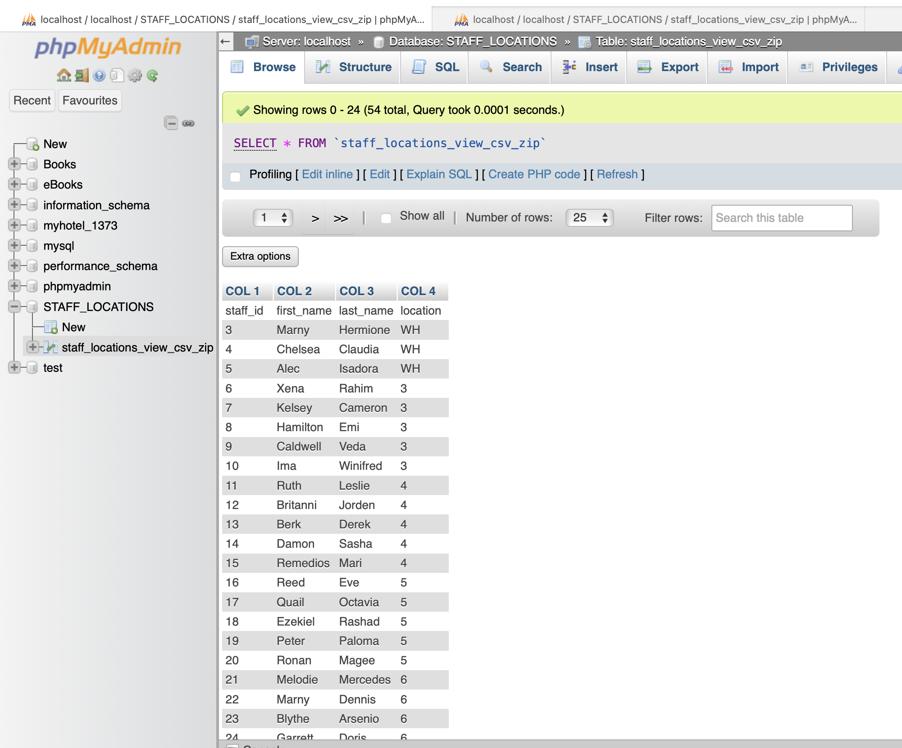

### [Task 10] Import coffee_shop_products data into a MySQL database
A new MySQL database named **coffee_shop_products** was created in phpMyAdmin, and the **product_info_m_view.csv** file was imported into a new table. The table contents were then reviewed to confirm that the product data was successfully loaded, and a screenshot was captured for submission.
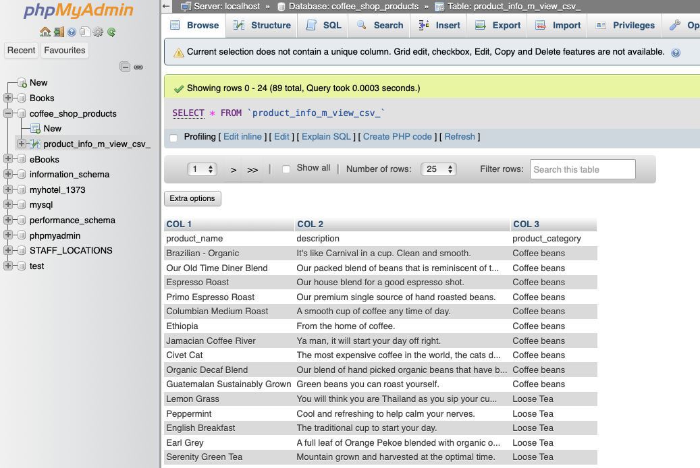
