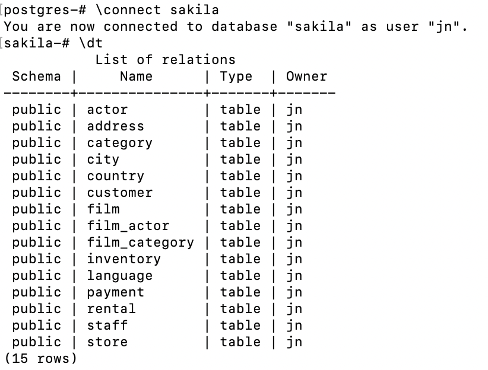
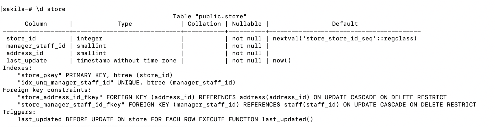
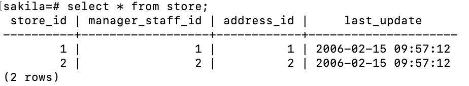

## Getting Started with the PostgreSQL Command Line

1) Postgresql Setup
    ```
    brew install postgresql
    brew services start postgresql
    ```
    PS. You can also ```psql --version``` in terminal to check that is it installed on your system
2) Go to the terminal project's directory and paste this
    ```
    curl -O https://cf-courses-data.s3.us.cloud-object-storage.appdomain.cloud/IBM-DB0110EN-SkillsNetwork/datasets/sakila/sakila_pgsql_dump.sql 
    ```
3) Activate postgres database: ```psql postgres```
4) Create a new database named sakila using the following command in the terminal: ```create database sakila;```

### **[Task]** Restore the structure and data of a table
1) To connect to the newly created empty sakila database, use the following command in the terminal and enter your PostgreSQL service session password: ```\connect sakila;```
2) Restore the sakila PostgreSQL dump file (containing the sakila database table definitions and data) to the newly created empty sakila database by using the following command in the terminal: ```\include sakila_psql_dump.sql(file path);```
### **[Task]** Explore and query tables
1) Explore tables in this database: ```\dt```
    
    PS. Somehow if \dt is not showing after dump it immediately you may need to ```\q``` then reconnect it and run the same command again
2) The structure of the store table:  ```\d```
    
3) Query 
    
    PS. This is case sensitive query, dont forget `;` after the query

### **[Task]** Dump/backup tables from a database
1) Run this in terminal of project directory: `pg_dump -U xxx -d sakila -t store > sakila_store_pgsql_dump.sql`
PS. xxx is the connect db as which user which you could run this to `\conninfo` in db terminal check