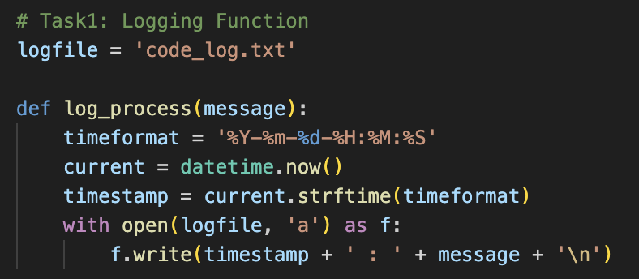
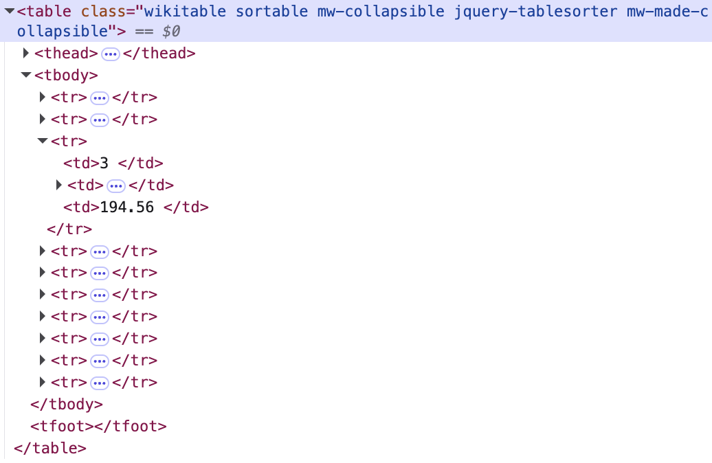
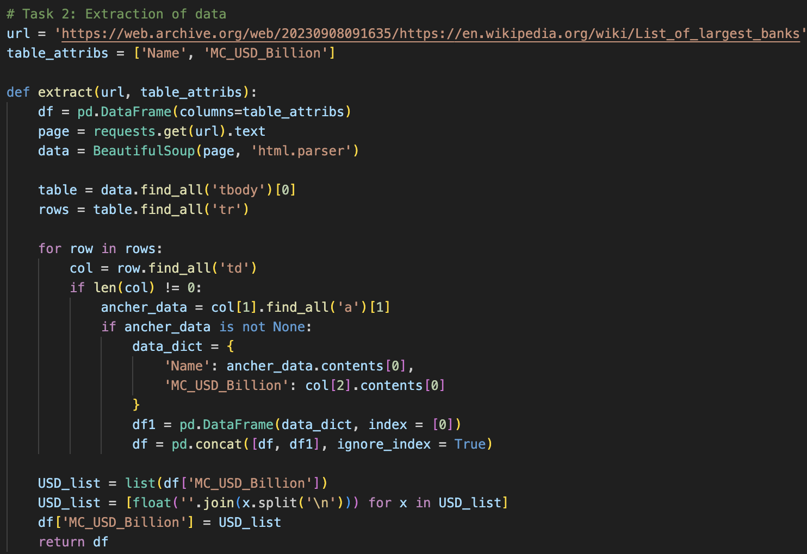
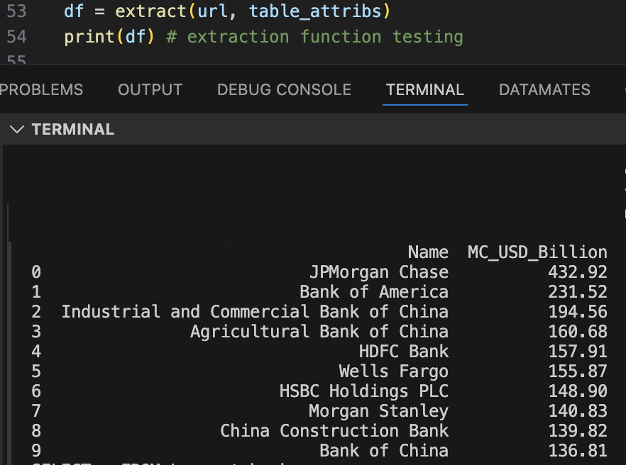
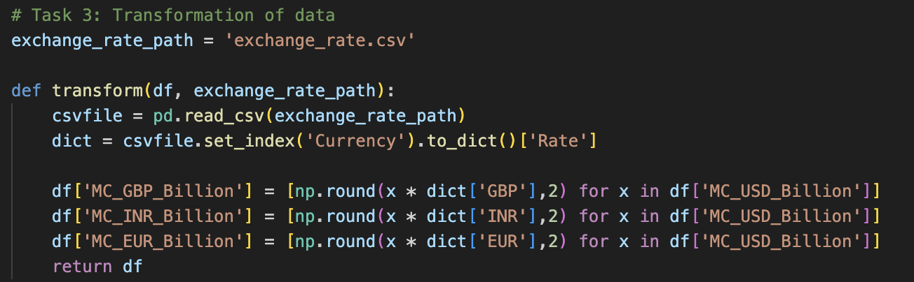
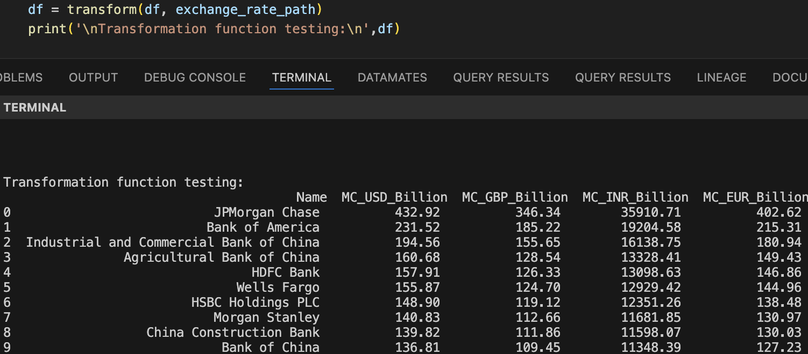
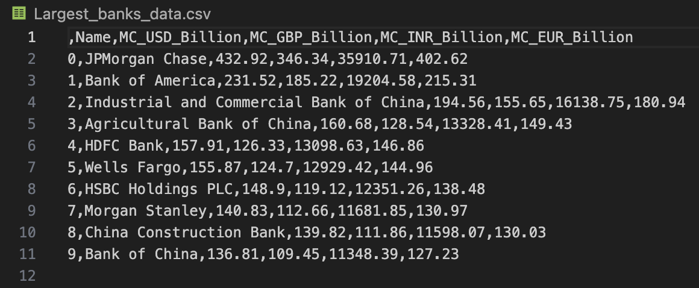
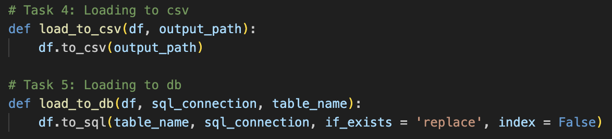
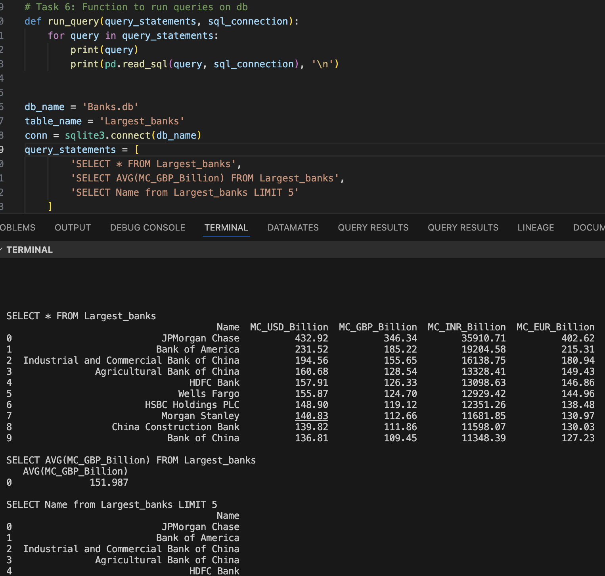
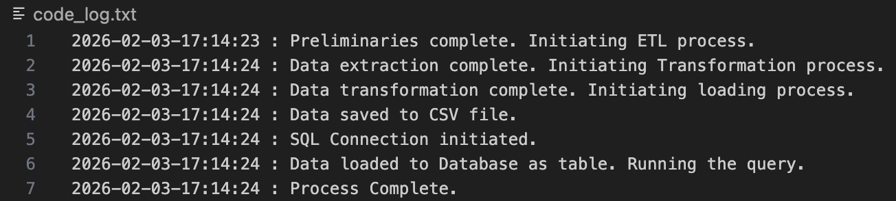

# Python Final Project for Data Engineering 

## Project Scenario

You are required to create a Python program that compiles a list of the **top 10 largest banks in the world**, ranked by **market capitalization in billion USD**.
The extracted data must then be **transformed into GBP, EUR, and INR**, using exchange rate information provided in a CSV file.

Finally, the processed data should be:

* Saved locally as a **CSV file**
* Stored as a **table in a SQL database**

---

## Project Tasks

### **Task 1: Logging**

Write a function `log_progress()` to log the progress of the code at different stages into a file named `code_log.txt`.
The function should record log entries using the provided list of log points to track execution progress.

---

### **Task 2: Data Extraction**

Extract tabular information from the given URL under the heading **“By market capitalization”** and store it in a pandas DataFrame.

**Steps:**

* **a.** Inspect the webpage and identify the position and pattern of the table in the HTML structure
    
* **b.** Write a function `extract()` to perform the data extraction
    
* **c.** Execute the function and verify the extracted output
    
---

### **Task 3: Data Transformation**

Transform the extracted DataFrame by adding columns for **Market Capitalization in GBP, EUR, and INR**, rounded to **2 decimal places**, using the exchange rate CSV file.

**Steps:**

* **a.** Write a function `transform()` to perform the transformation
    
* **b.** Execute the function and verify the transformed output
    
---

### **Task 4: Load Data to CSV**

Save the transformed DataFrame as a local CSV file.

* Write a function `load_to_csv()`
* Execute the function and verify the output file

---

### **Task 5: Load Data to Database**

Load the transformed DataFrame into a **SQL database server** as a table.

* Write a function `load_to_db()`
* Execute the function and verify the database table

---

### **Task 6: Run Queries**

Run SQL queries on the database table.

* Write a function `run_queries()`
* Execute the provided set of queries and verify the results

